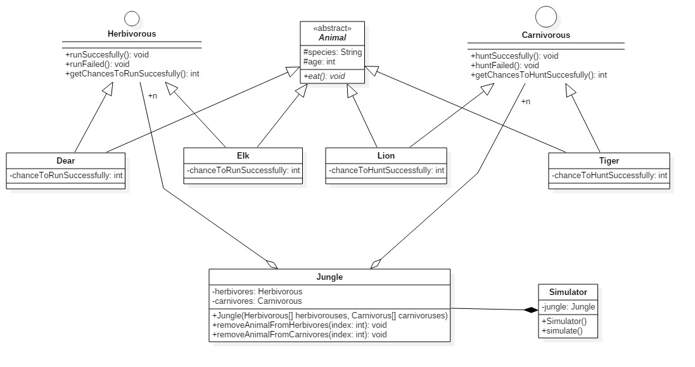
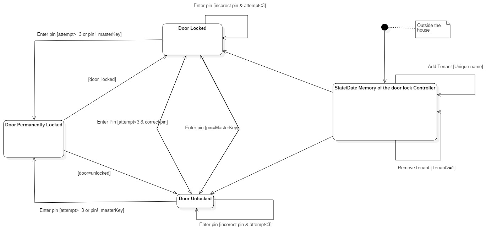
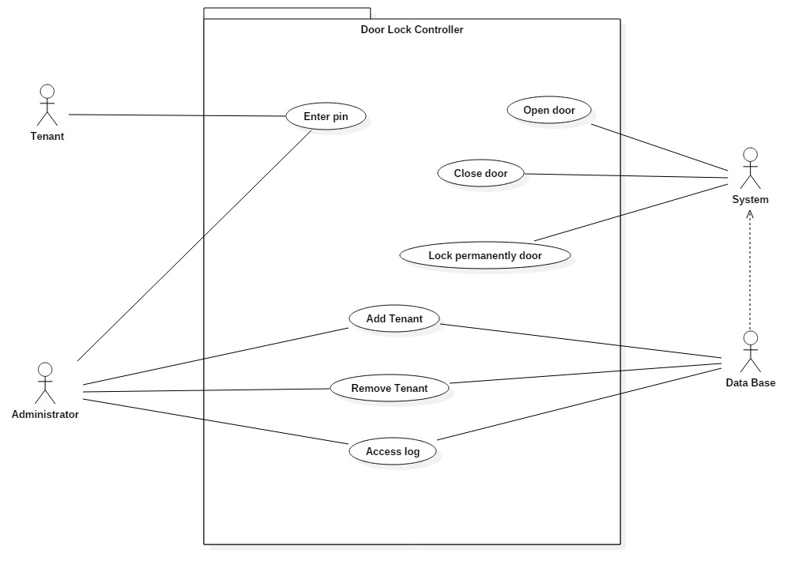

# Implement the following exercises

## Exercise 1

Given the UML class diagram above, implement the corresponding Java program. 

1. Create Java class based on the diagram above. 
    * After the creation of each Animal call the method eat which prints a message with the meal of each animal
    * The attributes _chanceTo*_ will take values in [0-100]
    * The implementation of methods _run*/hunt*_ from interfaces will print a message like: 
        * ${Animal} ${animal.name} hunt/run successfully/failed at age ${animal.age} with a chance of  ${animal.chanceToHuntSuccessfully}%
        * ex: Dear dearName run successfully at age 13 with a chance of 88%
    * The _Simulator()_ will create the Jungle which contains 20 herbivores(random nr of Elk/Dear) and 20 carnivores(random nr of Lion/Tiger) 
    * The _simulate()_ method will take random a herbivore and a carnivore from the jungle and will simulate a "fight" until there are only herbivores or only carnivores or is a draw.
    * After each duel the looser will be removed from jungle. In the end print a message with the winners if is not a draw
    * A draw happens when carnivores have their best participant equal in chances with the best participant from herbivores
        * ex: Tiger{chanceToHuntSuccessfully=98, name='16', age=48} and Dear{chanceToRunSuccessfully=98, name='1', age=3}
    * Feel free to add any methods you need
2. Call the simulate method in Exercise1 main method
3. Create a minimal unit test for testing the behavior of the created class.

## Exercise 2
A system is composed of 1 controller and 3 sensor types (TEMPERATURE, HUMIDITY, PRESSURE). Each sensor has a `void readSensor()` method which, when executed will randomly generate a value. 
Controller is registered as observer for the 3 sensors. Each time a sensor change it's value controller is notified and will print sensor value and sensor type.  

1. Implement a Java program based on the above description.
2. Test the functionality in `main()` method. From main readValue() method will be called for each sensor to test Observer pattern is working.

**Note** you should use Observer design pattern  

## Exercise 3

Implement a safe home access Java application based on the diagram above. Consider also following functional requirements in implementing your program:
1. If pin is wrong _enterPin_ method shall throw an _InvalidPinException_.
2. If 3 consecutive attempts are made to enter pin then door is locked(until master key pin is used) and _enterPin_ method shall throw TooManyAttemptsException. Any further invocations of _enterPin_ method will throw TooManyAttemptsException.
3. If master key pin is used, door will be unlocked and retries count will be reset to 0. 
4. If pin is correct, door shall be opened or closed depending on current state (if open will be closed, if closed will be opened)
5. When tenant already exists by name, _addTenant_ method will throw TenantAlreadyExistsException.
6. When tenant not found, _removeTenant_ method will throw TenantNotFoundException. 
7. All attempts (successful or not) will be logged in access log list.
8. Simulate all operations in _main_ from _SafeHome_.

**NOTE - Java project come with prefiled unit tests. You should make sure all tests pass. You are not allowed to change unit tests (except initialisation of Controller object in the _instantiateDoorController()_ method**).

## Exercise 3 - State machine diagram

For Safe Home Access application create _UML state machine_ diagram.  

## Exercise 3 - Use case diagram

For Safe Home Access application create _UML use case_ diagram. 

